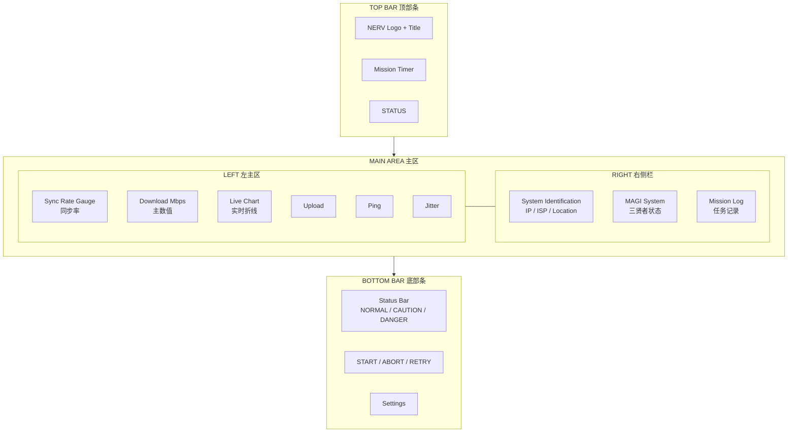

# NERV SPEED DIAGNOSTIC SYSTEM — 产品需求文档（PRD）

> 「ネルフ 回線速度診断システム」
> *GOD'S IN HIS HEAVEN, ALL'S RIGHT WITH THE WORLD.*

---

## 1. 文档信息

- **文档名称**：NERV 风格网速测试静态页面 PRD
- **版本号**：v1.0.0
- **作者**：NERV 第三新东京市技术部 / Cursor Agent
- **创建日期**：2026-05-03
- **状态**：Draft（待评审）
- **修订记录**
  - v1.0.0 / 2026-05-03 / 首版，覆盖功能、视觉、技术方案与验收标准

---

## 2. 产品概述

### 2.1 一句话定位

一个以 EVANGELION / NERV 中央指挥系统为视觉灵感的纯静态网络速度诊断终端页面，提供下载、上传、Ping、抖动测试与本机网络信息展示，部署形态为「单页 HTML + 同域后端测速脚本」。

### 2.2 产品目标

- **真实可用**：在自部署后端配合下，可作为生产可用的 LAN/WAN 测速工具
- **沉浸视觉**：完整复刻 NERV 中央作战室的终端美学，做到「打开页面就像登入 MAGI」
- **零依赖**：不调用任何第三方 API，不引入第三方前端框架，单文件即可分发

### 2.3 核心价值

- 给运维 / 极客 / EVA 粉丝同时提供「能用」与「好看」的速度测试体验
- 作为内网带宽巡检面板，可挂在大屏上长时驻留显示

---

## 3. 设计灵感与世界观

### 3.1 视觉来源

设计语言完全取自 EVANGELION 中 NERV 本部、MAGI 系统、EVA 同步实验舱的 UI：硬朗的工业排版、警示色块、危险斜纹、六边形蜂巢、十字网格、二进制装饰、衬线大写英文 + 日文假名/汉字双语标注。

### 3.2 参考图分析（位于工作目录）

- `nerv-logo.png` — NERV 标准枫叶 LOGO，用于左上角品牌位
- `1.png` — 标题排版与边框样式：白色衬线大写标题 + 橙色折角面板边框 + 红/绿斜纹危险条
- `2.png` — 透明分区式 overlay：左上角斜纹安全条、右上角小型监控视窗、底部红色状态条
- `3.png` — 24 种面板与 4 种风格变体：橙色边框面板、六边形蜂巢面板、纯黑边框面板，警告弹窗（NEW SUB / NEW FOLLOWER 风格）
- `4.png` — 屏幕状态卡（STREAM IS ABOUT TO BEGIN / PAUSED / OFFLINE）：橙红渐变 + 日文副标 `つづく / ストリーミング / 一時停止`
- `5.png` — 8 张 1920×1080 背景：斜纹危险条、十字网格、加号网格、六边形蜂巢、节点拓扑图，可作为页面底纹
- `6.png` — 装饰元素合集：GOAL 进度条、HOST/GUEST/CHAT 标签、二进制流、MENTAL TOXICITY LEVEL 阶梯条、SPEEDRUN MODE 计时器、SOUND ONLY 提示、CAM 监控视窗

### 3.3 借用的 NERV 视觉母题

- **配色**：纯黑底 + 鲜橙主色 + 高饱和红绿告警 + 极少量黄
- **图形**：六边形、斜向危险条、十字 / 加号网格、折角矩形、扇形仪表
- **排版**：英文衬线大写 + 日文假名/汉字副标 + 等宽数字
- **氛围**：扫描线、字符滚动、噪点、CRT 弧形光晕

---

## 4. 用户与场景

### 4.1 目标用户

- **U1 极客 / 运维**：希望快速测出某条线路的真实带宽
- **U2 内网管理员**：把页面挂在大屏上做 7×24 带宽巡检
- **U3 EVA 粉丝**：希望日常测速也能拥有「中二感」

### 4.2 典型场景

- **S1 家庭宽带自检**：用户打开页面 → 自动展示本机 IP/归属地 → 点击 START → 30 秒内拿到下载/上传/Ping → 状态条亮起绿色 NORMAL
- **S2 内网带宽巡检**：管理员将页面以全屏方式投影到指挥大屏，循环测试，关键指标低于阈值时面板转红并闪烁
- **S3 沉浸演示**：粉丝向朋友演示，页面以 BOOT 自检序列开机，模拟 MAGI 三贤者投票通过后才允许执行测试

---

## 5. 功能需求

### FR-01 下载速度测试

- 通过同域后端接口 `/backend/garbage` 持续拉取随机字节流
- 多并发分段下载（默认 4–8 路），每路独立计速后求和
- 采用滑动窗口（默认 5s）做加权平均，丢弃前 1.5s 慢启动样本
- 实时输出 `当前速率`、`峰值速率`、`平均速率`，单位 Mbps（可切 MB/s）
- 默认时长 15s，可配置 5–60s

### FR-02 上传速度测试

- 通过 POST/PUT 向 `/backend/empty` 持续推送伪随机二进制
- 同样多并发 + 滑动窗口
- 单独显示上传当前 / 峰值 / 平均速率
- 默认时长 15s

### FR-03 Ping / Jitter

- 向 `/backend/empty` 发送轻量 GET（预期 200 + 0 字节）
- 默认 10 次取样，去掉首次冷启动样本
- 输出：最小 / 最大 / 平均 Ping（ms）、Jitter（相邻样本差的标准化值）

### FR-04 公网 IP / 归属地 / ISP

- 由 `/backend/getIP` 返回 JSON：`{ ip, isp, country, region, city, asn, rawHeader }`
- 后端通过解析请求头与本地 IP 库（如 ip2region / mmdb）实现，前端不调用任何外部 API
- 前端展示：
  - `INTERNAL ADDRESS` —— 浏览器侧通过 WebRTC 尝试探测的本机内网地址（失败则显示 `———`）
  - `EXTERNAL ADDRESS` —— 后端返回的公网 IP
  - `LOCATION` —— 国家 / 省 / 市
  - `ISP / ASN` —— 运营商与 AS 号

### FR-05 状态分级

下载速率三档（可在配置中改）：

- **NORMAL（绿 #00FF88）**：≥ 100 Mbps
- **CAUTION（黄 #FFD400）**：20 Mbps ≤ x < 100 Mbps
- **DANGER（红 #FF1A1A）**：< 20 Mbps

Ping 三档：

- **NORMAL**：< 30 ms
- **CAUTION**：30 ≤ x < 100 ms
- **DANGER**：≥ 100 ms

档位变化时对应面板边框、数值颜色、底部状态条同步切换，进入 DANGER 档时叠加 1Hz 闪烁与微弱警报音（可静音）。

### FR-06 实时折线图

- Canvas 绘制，X 轴时间（最近 30s 滑动窗口），Y 轴速率（自适应量程）
- 同时绘制下载（橙）、上传（青）两条曲线
- 背景叠加十字网格，刻度文字使用等宽字体
- 仿 EVA 心率/同步率监控图样式

### FR-07 测试控制

- 主按钮 `[ START ]` —— 按下后变为 `[ ABORT / 中止 ]`
- 完成后显示 `[ RETRY / 再起動 ]`
- 进度由顶部水平 GOAL 进度条 + 圆形百分比双指示
- 按下 START 时播放 0.5s 启动动效（六边形展开 + 扫描线下落）

### FR-08 计时器与同步率装饰组件

- 顶部 `MISSION TIMER` 七段数码风时钟，从测试开始计时
- 左下 `SYNCHRONIZATION RATE / 同步率` 装饰仪表，数值由当前下载速率/峰值映射到 0–100%，纯装饰
- 右下 `MAGI SYSTEM` 三贤者状态：`MELCHIOR / BALTHASAR / CASPER`，分别绑定下载/上传/Ping 的状态档，三者状态合成结果显示 `VOTING: PASSED / DENIED`

### FR-09 历史记录

- 每次完成测试后将结果写入 `localStorage`，最多保留 20 条
- 右侧 `MISSION LOG` 面板倒序滚动展示，字段：时间戳、下载、上传、Ping、状态等级
- 提供 `CLEAR LOG / ログ消去` 按钮，二次确认后清空

### FR-10 启动序列动画

- 页面加载时播放 ~3s BOOT 序列：
  1. 全屏黑底打字机式输出 `INITIALIZING NERV SPEED DIAGNOSTIC ...`
  2. 三行系统自检：`MAGI ONLINE / NETWORK INTERFACE READY / TIME SYNCED`
  3. 渐显 NERV LOGO 与主界面
- 可通过 URL 参数 `?boot=0` 关闭，或在大屏巡检模式下默认关闭

---

## 6. 非功能需求

### 6.1 性能

- 首屏可交互时间（TTI） < 1.5s（本地资源，不计 BOOT 动画）
- 页面常驻 CPU 占用（空闲，含动画）< 5%（参考 M1 / i5-8 代）
- 测试期间内存增量 < 50 MB

### 6.2 浏览器兼容

- Chrome / Edge / Firefox 最近 2 个大版本
- Safari 16+
- 不强制兼容 IE 与早期移动端

### 6.3 响应式

- 设计基线：1920 × 1080（NERV 大屏）
- 向下兼容 1366 × 768（笔记本）
- 平板 1024 × 768：折叠装饰组件，保留主仪表 + IP 信息 + 折线图 + 控制按钮
- 手机：不在本期目标内（提示「请使用桌面端访问 / デスクトップ推奨」）

### 6.4 可访问性

- 颜色对比度满足 WCAG AA（核心数值文本）
- 警报闪烁可由用户在设置中关闭（避免光敏性癫痫风险）
- 提供 `Prefers-Reduced-Motion` 检测，自动降级动效

### 6.5 隐私

- 所有数据仅存于浏览器 `localStorage`，不上传第三方
- 公网 IP 由用户自部署的后端解析，页面底部显式声明此事实

---

## 7. UI / UX 设计规范

### 7.1 配色 Token

- `--bg-base` `#000000` —— 页面底色
- `--bg-panel` `#0A0A0A` —— 面板底色
- `--bg-grid` `#0E1410` —— 网格 / 蜂巢底纹
- `--accent-orange` `#FF6600` —— NERV 主橙，用于边框、标签底色、关键数值
- `--accent-orange-dim` `#A33F00` —— 主橙暗调，用于次级边框
- `--status-normal` `#00FF88` —— 安全档位绿
- `--status-caution` `#FFD400` —— 注意档位黄
- `--status-danger` `#FF1A1A` —— 危险档位红
- `--text-primary` `#FFFFFF` —— 主文本
- `--text-mute` `#9AA0A6` —— 次级文本 / 提示
- `--text-jp` `#FF9933` —— 日文副标
- `--scanline` `rgba(255, 102, 0, 0.06)` —— 全局扫描线叠加

### 7.2 字体

- **英文标题**：`Bebas Neue` / `Acumin Pro Condensed` / 退化到 `Impact, "Arial Narrow Bold"`
- **英文正文**：`Roboto Condensed` / 退化到 `system-ui`
- **日文**：`Noto Sans JP`，半角假名优先，标题用 700 字重
- **等宽数字与代码**：`JetBrains Mono` / `Consolas`
- 字号阶（rem 基准 16px）：H1 3.0 / H2 2.0 / H3 1.4 / Body 1.0 / Caption 0.75

### 7.3 图形元素清单

- **斜纹安全条**：45° 红黑或绿黑相间，宽 12px，用作面板边框装饰
- **六边形蜂巢**：半径 18px、间距 2px，铺满次级面板背景
- **十字网格**：32×32 间距，加号端点 4px，用于主背景与图表底纹
- **折角橙边框**：1px 实线 + 四角 12px 内折，可选发光阴影 `0 0 8px var(--accent-orange-dim)`
- **二进制流**：等宽 0/1 字符纵向滚动，16px 字号，10% 透明度
- **扇形仪表**：270° 弧，分 30 段，激活段为状态色，未激活为 `#1a1a1a`
- **七段数码**：仿 LED，使用 `digital-7` 字体或 SVG 实现
- **半透明蒙层**：`rgba(0,0,0,0.6)` + 1px 橙边，用于弹窗

### 7.4 主屏分区（1920×1080 基线）

- **顶部条 (高 80px)**：左侧 NERV LOGO + `NERV SPEED DIAGNOSTIC SYSTEM / 回線速度診断システム`，右侧 `MISSION TIMER` 与 `STATUS`
- **左主区 (宽 1180px)**
  - 顶部：`SYNCHRONIZATION RATE / 同步率` 扇形仪表 + 当前下载速率超大字号
  - 中部：实时折线图（FR-06）
  - 底部：上传速率、Ping、Jitter 三个并排小仪表
- **右侧栏 (宽 660px)**
  - 上：`SYSTEM IDENTIFICATION` —— IP / 归属地 / ISP / ASN（FR-04）
  - 中：`MAGI SYSTEM` 三贤者状态（FR-08）
  - 下：`MISSION LOG` 历史记录列表（FR-09）
- **底部条 (高 60px)**：状态等级横条（NORMAL / CAUTION / DANGER 三段灯）+ `START / ABORT / RETRY` 主按钮 + 配置入口
- **全局叠加层**：扫描线、噪点、CRT 边角暗角、可选 BOOT 启动动画

### 7.5 状态档位切换规则

- 档位由数值实时计算，进入新档位时：
  - 关联面板边框颜色平滑过渡 200ms
  - 数值文字颜色立即切换
  - 底部状态横条对应灯亮起，其余熄灭
  - 进入 DANGER 时叠加 1Hz 闪烁与可选 800Hz 短促告警音

### 7.6 动效规范

- 全局扫描线：从上到下循环 6s
- 数字跳动：测试中每 100ms 刷新一次，非线性缓出
- 字符滚动：BOOT 序列 30 字符/秒
- 警报闪烁：1Hz，亮 50% / 暗 50%
- `prefers-reduced-motion: reduce` 时全部降级为「直接到末态」

### 7.7 文案规范

所有一级标签同时给出英文大写与日文副标，例：

- `SYNCHRONIZATION RATE / 同步率`
- `EXTERNAL ADDRESS / 外部アドレス`
- `MISSION LOG / 任務記録`
- `START / 開始` ｜ `ABORT / 中止` ｜ `RETRY / 再起動`

---

## 8. 信息架构与线框图



---

## 9. 技术方案

### 9.1 技术选型

- **前端**：原生 HTML5 + CSS3（含自定义属性、CSS Grid、`backdrop-filter`）+ 原生 JavaScript（ES2020），无任何框架依赖
- **图形**：Canvas 2D（折线图、扇形仪表、七段数码），SVG（NERV LOGO、装饰边框）
- **后端**：PHP 8+ 与 Node.js 18+ 双方案任选其一，接口契约一致
- **IP 库**：后端使用 ip2region.xdb（PHP/Node 均有 SDK）实现归属地解析，无外部 API
- **打包**：无构建步骤，单文件 `index.html` + 同级 `assets/` 即可部署

### 9.2 后端接口契约

> 所有接口同域部署在 `/backend/` 路径下，CORS 不需开放。

- **GET `/backend/garbage`**
  - Query：`ckSize`（单位 MiB，默认 100，上限 1024），`r`（随机 query 防缓存）
  - Header 响应：`Content-Type: application/octet-stream`，`Cache-Control: no-store`，`Content-Encoding: identity`
  - Body：指定大小的伪随机字节流（推荐由 `/dev/urandom` 或 `random_bytes` 生成）

- **POST/PUT `/backend/empty`**
  - 接受任意大小请求体，丢弃后立即返回 `200`，Body 为空
  - 用作上传 sink 与 Ping 测试

- **GET `/backend/getIP`**
  - 响应 JSON：

    ```json
    {
      "processedString": "1.2.3.4 - China Telecom, Shanghai, CN",
      "rawIspInfo": {
        "ip": "1.2.3.4",
        "country": "CN",
        "region": "Shanghai",
        "city": "Shanghai",
        "isp": "China Telecom",
        "asn": "AS4812"
      }
    }
    ```

  - 字段命名兼容 LibreSpeed 习惯，方便迁移

### 9.3 测速算法要点（参考 LibreSpeed）

- 多线程并发数 `xhr_dl=6`、`xhr_ul=3`
- 单分块大小 `dl=100MiB`、`ul=20MiB`，达到上限自动追加
- 滑动窗口 5s 加权平均，权重为最近样本更高
- 慢启动忽略：丢弃下载前 1.5s、上传前 3s 样本
- 总时长上限：下载 15s / 上传 15s / Ping 10 次 + 1 次冷启
- 单位换算：1 Mbps = 1,000,000 bit/s，UI 默认 Mbps 可切 MB/s

### 9.4 推荐目录结构

```
speedtest-6.1.0/
├── index.html              # 入口页面
├── prd.md                  # 本文档
├── assets/
│   ├── css/
│   │   └── nerv.css        # NERV 主题样式
│   ├── js/
│   │   ├── boot.js         # 启动序列
│   │   ├── speedtest.js    # 测速核心
│   │   ├── chart.js        # Canvas 折线图
│   │   ├── gauge.js        # 扇形仪表
│   │   └── ui.js           # 状态切换、日志、控件
│   ├── fonts/              # 自部署字体
│   ├── img/
│   │   ├── nerv-logo.svg
│   │   └── patterns/       # 蜂巢、网格、斜纹底图
│   └── audio/
│       └── alert.wav
└── backend/
    ├── garbage.php         # 或 garbage.js
    ├── empty.php
    ├── getIP.php
    └── ipdb/
        └── ip2region.xdb
```

---

## 10. 验收标准

- **AC-01**：在 100Mbps 自部署内网环境下，下载测试结果与 `iperf3` 相对偏差 ≤ 10%
- **AC-02**：上传测试在 100Mbps 上行带宽下相对偏差 ≤ 15%
- **AC-03**：Ping 与系统 `ping` 命令在同一网络下平均偏差 ≤ 5ms
- **AC-04**：`/backend/getIP` 在国内主流 ISP 下能准确返回省级归属地
- **AC-05**：1920×1080 屏幕首屏完整呈现所有六大分区，无横向滚动条
- **AC-06**：BOOT 序列总时长 ≤ 3.5s，可被 `?boot=0` 关闭
- **AC-07**：进入 DANGER 档时面板边框、数值颜色、底部状态条三处颜色保持一致并按 1Hz 闪烁
- **AC-08**：连续运行 1 小时，浏览器内存增长 ≤ 100MB
- **AC-09**：所有英文标签均配有日文副标，且日文使用 `Noto Sans JP` 正确渲染
- **AC-10**：清空 `localStorage` 后页面仍可正常进入与运行
- **AC-11**：开启 `prefers-reduced-motion` 时所有循环动效自动停止，仍保留功能

---

## 11. 里程碑

- **M1 PRD 评审**（本周）—— 本文档定稿
- **M2 视觉静态稿**（+1 周）—— 完成 `index.html` + `nerv.css` 静态布局，所有面板就位但数值为占位
- **M3 测速核心接入**（+2 周）—— 接入后端三接口，下载/上传/Ping/Jitter/IP 全部跑通
- **M4 动效与打磨**（+1 周）—— BOOT 序列、折线图、警报闪烁、历史记录、可访问性
- **M5 联调与发布**（+0.5 周）—— 多分辨率与多浏览器回归，输出部署文档

---

## 12. 风险与限制

- **浏览器带宽天花板**：单浏览器进程在某些网络栈下难以跑满千兆，需提示用户「真实带宽请以 iperf 为准」
- **HTTPS 混合内容**：若页面走 HTTPS 而后端走 HTTP，浏览器会阻断，需要部署文档明确同协议要求
- **运营商 QoS / CDN 加速干扰**：本地后端测试可避免，但如果部署在公网 VPS，运营商对短时大流量可能限速
- **WebRTC 内网 IP 探测**：现代浏览器逐步限制此能力，可能拿不到内网地址，需有降级显示
- **IP 库时效**：ip2region.xdb 需要定期更新，文档中给出更新指引
- **音频自动播放策略**：警报音需在用户首次交互后才能播放，进入页面前不能响

---

## 13. 后续可扩展

- **多节点选择**：在右侧栏增加 `RELAY NODE` 下拉，支持多个自部署后端切换
- **IPv6 双栈**：同时显示 v4 / v6 公网地址与对应链路质量
- **PWA 离线壳**：将界面与字体打入 Service Worker，离线也能展示历史记录
- **大屏巡检模式**：循环测试 + 异常告警推送到 Webhook（可选企业微信 / 飞书）
- **国际化**：在中英日基础上扩展英文 UI 模式 `?lang=en`
- **主题切换**：除 NERV 经典橙黑外，再做一套 EVA-01 紫绿配色与 SEELE 黑红配色

---

> 本文档为静态页面 `index.html` 与同域后端测速脚本的设计依据。所有视觉资产应严格遵循第 7 节的设计规范，所有功能实现应严格满足第 5、9 节的需求与契约。
>
> 「逃げちゃダメだ。逃げちゃダメだ。逃げちゃダメだ。」
